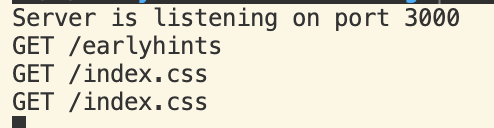
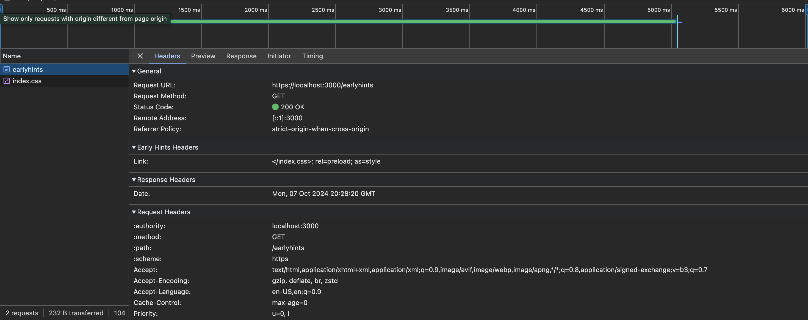

## Chrome Doesn't Load Preloaded 103 Early Hints Resources from Disk Cache

### Requirements
* Chrome 129
* Node 20
* Ability to generate SSL certs for an http2 server

### Try it out
* You'll need to generate SSL certs at `cert.pem` & `key.pem` in this directory or use the existing ones if they work
* Open devtools in Chrome to the network tab
* Run `node index.js` and navigate to `https://localhost:3000/earlyhints` in Chrome 129
* Notice that the server logs show `GET /earlyhints` and `GET /index.css` before the response has finished. There's a 5s delay in the response to help illustrate this.
* Notice that before the response completes Dev Tools shows no outgoing requests for `GET /index.css` despite our server clearly receiving that request
* When the response completes after 5s notice the server logs show a second request to `GET /index.css`
* In dev tools notice that there is now a request to `GET /index.css` that was initiated after the response completed.
* Notice also in dev tools that the `GET /index.css` request's initiator is listed as `Early Hints` but the size does not say `(disk cache)` as the [Chrome Developer Docs](https://developer.chrome.com/docs/web-platform/early-hints#browser-support) suggest

### Problem
When returning a 103 Early Hints header with preload links then Chrome will correctly fetch the resource before the response has finished.

When Chrome sees a `<link>` tag in the `<head>` of the response it will issue another request for that resource. Instead of fetching that resource from the Disk cache as the [Chrome Developer docs](https://developer.chrome.com/docs/web-platform/early-hints#browser-support) suggest, it will instead make a duplicate request to the server for this resource.

This means that using 103 Early Hints could actually be worse for performance than not using them since Chrome is issuing an additional request for the resource with no benefit.

This repo contains a reproducible example of this behavior and you can verify it by looking at the server logs.

### Images
Screenshot of the server logs generated by a single navigation to `https://localhost:3000/earlyhints

Dev Tools shows the early hints headers in the document request

But Dev Tools only shows 1 request to `/index.css`, not the two our server shows. It also doesn't load from `(disk cache)` like it's supposed to

